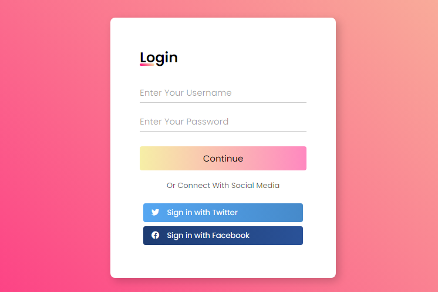

<h1 align="center">Login Form</h1>

Projeto criado pela Giovanna Moeller do @girl.coding, com tutorial no Youtube. Este é um formulário de login simples e responsivo feito com HTML e CSS usando transições. 

---

 

## 🚀 Techs

As seguintes tecnologia foram usadas na construção do projeto:

- HTML
- CSS

## Developer

<a href="#">
 
  
 <b></b></a> 
 
Feito com 💜 por Sabrina Alves

 
 
  

